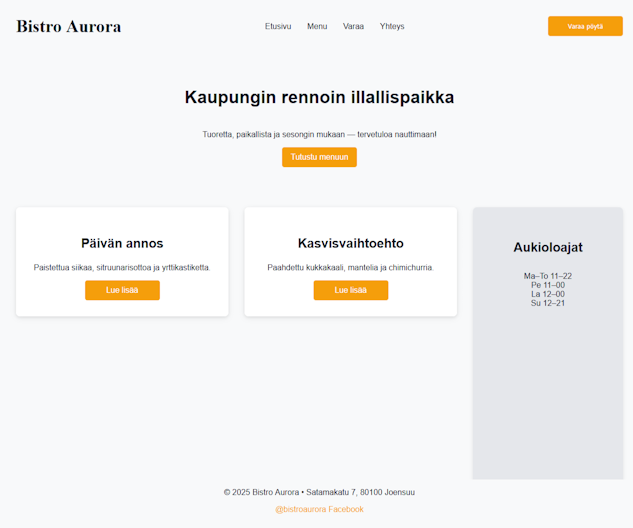

# Sass-demo

Assignment for Web course



## _variables.scss
Variables for colors, font styling and maximum width.

## _mixins.scss
Definitions for containers, buttons, navigation and mobile responsiveness.

## _layout.scss
Uses variables and mixins to put all together

## style.scss
Only global stuff like body


# Sass specific features used

Variables
```
_variables.scss

$text-color: #111827;
```
Used in other files with
```
@use "variables";
color: variables.$text-color;
```
Mixins, example for mobile responsiveness
```
_mixins.scss

@mixin responsive($breakpoint) {
	@if $breakpoint == mobile {
		@media (max-width: 768px) { @content; }
	}
}
```

```
_layout.scss

@include mixins.responsive(mobile) {
  grid-template-columns: 1fr;

  .sidebar {
    grid-column: 1;
    height: auto;
  }
}
```

Nesting, inheritance and functions
```
_layout.scss

.site-footer {
  @include mixins.base-container;
  margin-bottom: 2rem;
  gap: 1rem;
  text-align: center;
  color: variables.$text-light;

  .social a {
    color: variables.$accent-color;

    &:hover {
      color: lighten(variables.$accent-color, 15%);
    }
  }
}
```

